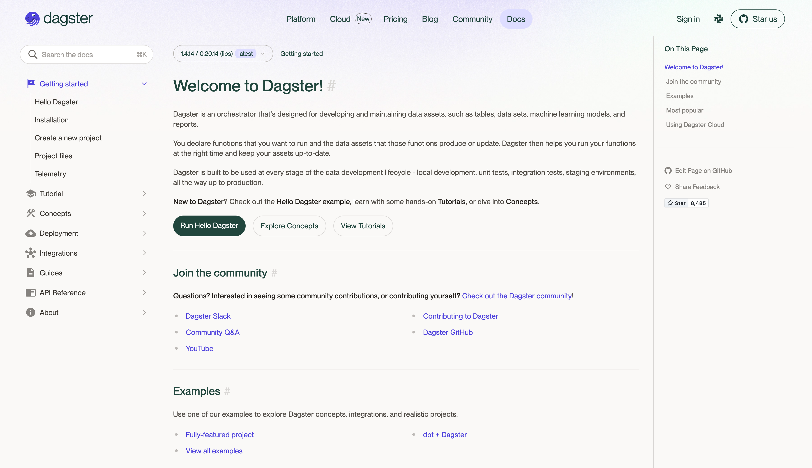

<style scoped>
h1 { line-height: 1.25; margin-bottom: 1rem; }
p { font-size: 75%; margin: 0.25rem; }
</style>

# Have you tried Dagster?

TP Chung @ Airflow Summit 2023

`tp@astronomer.io`
`@uranusjr`

<!--

My name is TP and I work for Astronomer on the open source Airflow team.

But here I'm going to talk not for the company.

-->

---

<style scoped>
img { position: absolute; left: 0; top: 0; width: 100%; }
</style>



<!--

If you've never heard of it...

(Read the first paragraph.)

Basically you can write and run DAGs with Dagster, if you know what that means.
Sounds like a familiar concept, not sure why.

-->

---

<style scoped>
img { position: absolute; left: 0; top: 0; width: 100%; }
</style>


<!--

I see some angry stares down there. OK, before you shoot me right on stage,
here's the real story.

I was at PyCon Taiwan earlier this month. I'm from Taiwan by the way, this
is my local conference. By the way all PyCons are awesome and wherever you're
from you should attend one near you and many more. It's awesome.

Anyway there's this one talk I was very intrigued by at the conference where
a speaker talked about his experience with Dagster at work, and I was thinking
"oh! maybe I should try to lure him to the dark side. There are takeaways I got
from the conversation; the original intention was to post it in the mailing
list or Slack, but I got a bit lazy and never turned around to do that. So this
is my effort to force myself to talk about this and maybe get some interest in
it.

-->

---

<style scoped>
ul { margin: auto; }
</style>

- Software-defined assets
- Easy local incremental development
- Entire pipeline in one machine/pod

<!--

There are three main things I got out of the conversation why the speaker chose
Dagster over *certain other competitors that I'm not going to name*

(Read the three bullets.)

Remember, these are features a person specifically calls out as reasons they
chose Dagster over other solutions.

-->

---

<style scoped>
pre { margin: 1rem 20%; }
</style>

## Software-defined assets

```python
from dagster import asset

@asset
def sugary_cereals() -> None:
    execute_query("""
        CREATE TABLE sugary_cereals
        AS SELECT * FROM cereals
    """)

@asset(deps=[sugary_cereals])
def shopping_list() -> None:
    execute_query("""
        CREATE TABLE shopping_list
        AS SELECT * FROM sugary_cereals
    """)
```

<!--

Software-defined assets are decorated functions that return something for
downstream dependencies to use. The gist you can define what your data look
like, instead of what you do to shape the data. Notice the function names are
nouns, not verbs.

But beyond naming, Does this example lookg familiar? Yeah me too.

-->

---

## Taskflow

- Get rid of imports oddities
- Admittedly a bit more verbose
- **Needs better advertisement**

<!--

Have you heard of taskflow? That's the quote-unquote NEW way to write Airflow
tasks that many forget about. We've had talks about them too here at the
Summit! Use them more. There are some room for improvements though.

(Read the FIRST TWO bullets)

-->

---

## Opininated Guides

- Airflow is (probably?) not opininated
- Newcomers want directions
- Choices are confusing (until you have context)

<!--

And the
most important of all, I feel we should advertise them front-and-center so
people know about them. We sometimes talk about how Airflow is unopinionated
and assists you do whatever you want, in whatever way you want. And that's a
good thing. But that also creates confusion to newcomers that I feel should be
improved.

Using classical operators vs taskflow is a CHOICE, but choices are not always
good, especially when you lack information to make your own choice. So I feel
opininated guides should be a thing, and perhaps taskflow should be the star
of the show instead of a side note after operators are introduced.

-->

---

## Easy development

- Airflow only supports Linux
- `airflow standalone` is bulky
- How do you do unit tests?

<!--

This is one area Airflow really does poorly. We have `dag.text()`, but
officially only Linux is supported as a platform, so you can run into all sorts
of problems trying to run the DAG on whatever machine you are on.

Not to mention if you want to see your DAGs in the web UI...oh gosh is Airflow
bulky. Even with the RELETIVELY RECENT addition of `airflow standalone`, it's
still way too difficult to run Airflow locally, not to mention how uncommon
Linux is as a development machine in the first place, and setting up Docker is
not at all trivial for many folks.

And how to do do unit tests? Airflow doesn't really have a story here.

-->

---

```python
def test_job():
    result = do_math_job.execute_in_process()

    # return type is ExecuteInProcessResult
    assert isinstance(result, ExecuteInProcessResult)
    assert result.success
    # inspect individual op result
    assert result.output_for_node("add_one") == 2
    assert result.output_for_node("add_two") == 3
    assert result.output_for_node("subtract") == -1
```

<!--

This is the example Dagster gives in documentation, for what is worth. Looks
like a regular Pytest test with just a little framework-specific logic. Can we
have something like this for Airflow?

-->

---

## All-in-one Pipeline

- Every Airflow task is isolated
- Sound in theory, forces best practice
- Sometimes we just want to cut corners

<!--

This is a good one and might require some explaining. When Airflow's executor
runs a task, it starts a worker entity to run it in isolation. This can be a
process on a machine, or a Kubernetes pod if you use that, or something else.
This is a FEATURE and a very nice thing that encourages best practice because
you know, functional programming, not side effects, separate of concerns,
things like that.

But sometimes we just want to cur corners, you know. Dagster has this "FEATURE"
that just runs an entire DAG run in one single pod so you can carry the side
effects from a task to another, and this is mentioned explicitly as a plus.
Wild, I know, but let's be honest, there are times we just want to do this
because practically it's just easier, and we're all grown-ups here that can
take consequences.

This goes back to the opinianated point, but in the other direction. It's all
about balancing between what we guide people to and how we let people choose.
Maybe a LESS perfect solution is not that bad an idea after all? Is this
possible with the right executor abstraction and good documentation? I don't
know, but we should find out.

-->

---

## Thank you!


- `tp@astronomer.io`
- Post on `#development`
- `uranusjr` in most places
- `@uranusjr@g0v.social`

<!--

Again, these are all ideas I got from that one conversation with someone that's
not even an Airflow user. I'm not sure if they are good ideas at all, but I
feel it's worthwhile to find out. So talk to me! What do you think? Are you
interested?

My email is tp@astronomer.io and I'm on the dev mailing list. I'm also on Slack
as TP Chung and I read the development channel. You can also find me on mostly
anywhere by my handle, or on Mastodon on the g0v.social server. That's a zero,
not an O.

Thank you!

-->
